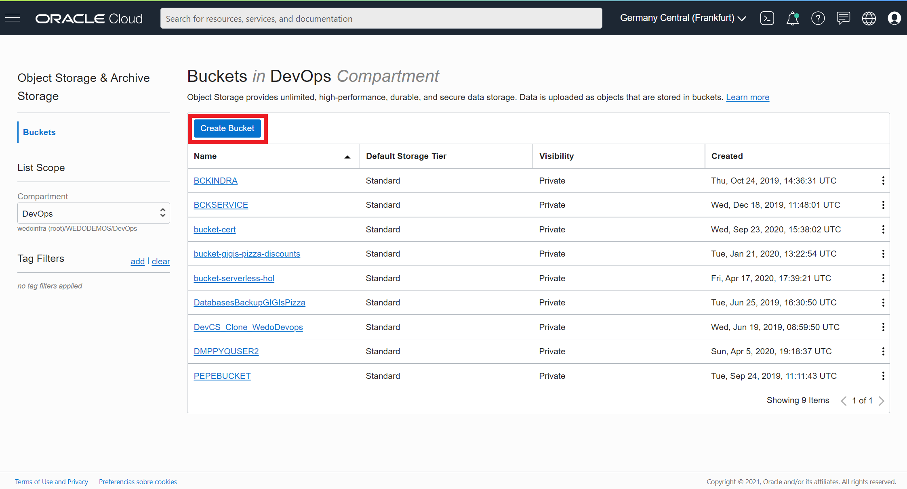
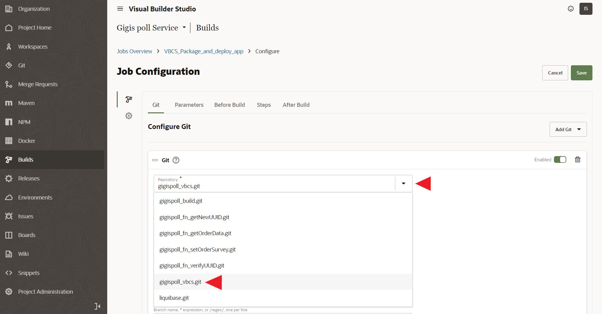
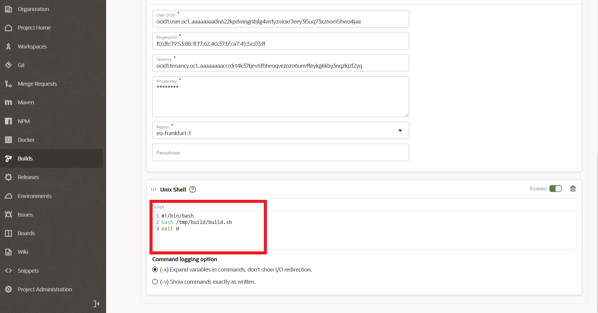
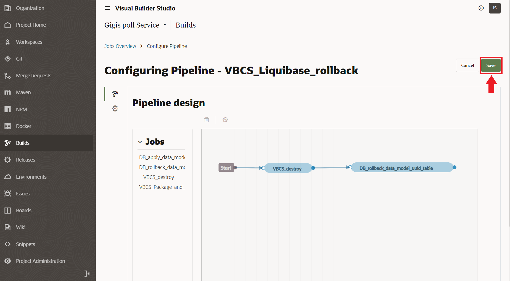

[](https://www.oracle.com/code-one/)

# Gigi's Polls - GitOps and LiquiBase HOL
This HOL is based in a Demo developed by Spain Presales Tech Team as part of an innovation initiative to approach Oracle Cloud Solutions by providing practical examples that could be “touched” and easily understood.

Demo is known as Gigi’s Pizza. This Use Case is focused in GitOps and LiquiBase. In Gigi's Pizza demo we have three microservices coded in different languages like nodejs and of course Java (Helidon framework). This three microservices are part of a delivery pizza app, one microservice controls the orders, other one controls the pizza delivery and the last one controls the accounting. 


In the first demo version, we don't have any feedback from the customer that receive a pizza, so imagine that the marketing and business areas want to know that feedback to improve the pizza delivery service or to create new pizza types. To create this new feedback service we have to modify the SQL DB PDB adding new tables in the squema and several fields in the tables. To create a DB squema version we will use LiquiBase, a software that let you create squema versions. We could return to a previous version of the Data Base after a failure or bad feeback of an app version (canary deployment for example) in an easy way with LiquiBase that is included with Oracle SQLPlus software.


This GitOps Hands On Lab includes:

* Oracle Visual Builder Studio.
* LiquidBase included in Oracle SQLPlus software.
* Oracle Cloud Infraestructure: 
  * Compute
  * Networking
  * Resource Manager (Terraform as a service)
  * DBCS
  * Serverless Functions
  * API Gateway

# In this Hands on Lab

All HOL was written in English and all the screenshots are in English Language. We recomend you that select English as your default language in Oracle Cloud. Select the Earth Icon at the top right (near your profile icon) and change the language to English.

In this HOL you will create a poll app for customer feedback.

You will:

* Create a new feedback webpage with Oracle Visual Builder Studio.
* Modify the current microservices to include the new Data.
* Deploy webapp in a separate server (IaaS compute) instead of use the internal Visual Builder server to improve cost savings.
* Terraform and sh scripts will be used to automate the deployment. 
* All deployment files (terraform + sh + liquibase scripts) will be in a GIT repo (GitOps) in Visula Builder Studio.
* Create the jobs and pipelines to deploy the app and modify the Data Base.
* Create the jobs and pipelines to delete the app and return the Data Base to initial state.

Let's create the new Service!

# Visual Builder Import
First Step to create the Gigi's Poll Service is to get the Visual Builder Studio project zip file from github and upload it to an Oracle Object Storage Bucket in your tenanty.

Download the zip file from github [here](https://github.com/oraclespainpresales/GigisPizzaHOL/raw/master/downloads/wedo-devops-pollservice-demo.zip)

Then upload it to an OSS Bucket in your tenancy. You can use a created OSS Bucket or create a new one. Next step will describe how to create a new OSS Bucket to upload the zip file.

## Creating the OSS Bucket
Go to Hamburguer Icon to open the Oracle Cloud Console menu. Select Storage and Buckets.


Click **Create Bucket** button to create a new Bucket in your compartment (note: review your compartment name before create the new buacket, to create the bucket in the appropiate compartment).



In the right window, change the name of the bucket to a descriptive one, for example [**bucket-vbcs-poll**]. Review the rest of the bucket features as default. Standard type and Encrypt using Oracle managed keys. Then click Create button to create the new Bucket.


The new bucket must be shown in the buckets list.


Click on it to access the bucket console menu and click **Upload** button to upload the zip file. 


In the right console menu you must write a descriptive name like [**vbcs-pollservice-project**], and drag and drop the zip file in the dotted square or click on "select files" link to open a file browser to select the zip file. 


After the upload, the file name and size will be shown just below the dotted quare. Next click **Upload** button to put the file in the OSS Bucket.


A new "Finish" menssage in the name/size will be shown and then you can click **Close** button to return to the bucket console menu.


The new zip file should be in the Object list of the Bucket.


Now you have the zip file prepared, to be imported in the Visual Builder Studio new project.

# Create the Visual Builder Project
Next step to create the new poll service will be create and import a new visual builder project that will contain all required files. This import will create a new GIT repo in your Visual Builder Studio. Let's start creating a new project from the Visual Builder Studio main panel -> Organization and click **Create** button.


Then write an appropiate and descriptive project name like [**Gigis poll Service**] and a little description. Keep the Security as Private and Preferred Language English. Then click **Next** button.


Next select Import Project from the project type list and click **Next** to continue with the creation process.


Now you must fill the form with your own credentials (you can get this credential from the OCI console, if you don't remember how to get this values you can read this [example](https://github.com/oraclespainpresales/GigisPizzaHOL/blob/master/microservices/hol5967_userguide.md#getting-key-config-data-from-oracle-cloud-tenancy)):

- Your Tenancy OCID.
- Your User OCID.
- Home Region.
- Your API Key Private key.
- Your API Key passphrase for the private key if you use one (optional).
- Your API Key Fingerprint.
- Your Compartment OCID, where the zip file was uploaded to the bucket.
- Your Storage namespace.

Then click **Next** button to continue.


If all values are correct then you can access your tenancy OSS and buckets. Select the bucket [**bucket-vbcs-poll**] created in the First part of the demo and the zip file [**vbcs-pollservice-projectwedo-devops-pollservice-demo.zip**] that you upload in there. Click **Finish** button to finish the project creation process. 


Then you should see the creation project process task list. Wait for a while (about 3 or 4 minutes) to VBCS finish all the tasks.


After project creation completion, you should see the new Project Gigi's Poll Service home page.


The Process continue importing the zip file to the new project, so you should wait about 20 o 25 minutes (depending of the overload of the vbcs service) to complete all the importing task. In this process you will get the GIT repos with all files (including the Serverless functions code in nodejs), the VBCS project (visual low code app), associated CI/CD pipelines and more.


# Review the Project files
After project creation and file zip import, you must have several GIT repos in your new project. 

There are four related to the Serverless Functions (developed in nodejs):
- gigispoll_fn_getNewUUID
- gigispoll_fn_verifyUUID
- gigispoll_fn_getOrderData
- gigispoll_fn_setOrderSurvey

And other 3 GIT repos related to Gitops, LiquiBase and VBCS app
- liquibase
- gigispoll_build
- gigispoll_vbcs

Select Git from the main menu to access to the GIT repos for review.


<details>
 <summary>liquibase git repo (click to show)</summary>
 
## liquibase git repo
In this repo you should have all files related to the liquibase functionality. The sqlScript folder contain the necessary script files to create and destroy tables and fields in the Data Base.

You must have 5 files, 4 sql files and a xml. 


### File controller_db_gigis.xml
Is the liquibase creation and destroy script controller. If you open it you could see that there are several changesets with the sql script to create/modify tables and fields in the Data Base, and the appropiate rollback sql script to rollback the creation/modification sql scripts. If you want to know more about liquibase please visit the [liquibase.org](https://www.liquibase.org/) web page they have more examples.


### SQL script Files
They are the sql scripts, to create/modify the current schema. The new poll functionality need a change in the SQL PDB schema to add the new coments and survey score.
| File     | Description |
|----------|-------------|
| script_uuidtable.sql |  create a new table in the SQL PDB Schema to store the user UUIDs. |
| script_uuidtable_rollback.sql |    rollback script of script_uuidtable.   |
| script_tablepayment_survey.sql | modify fields in tables to add the survey score and comments. |
| script_tablepayment_survey_rollback.sql | rollback script for script_tablepayment_survey. |

You can open the different files to review them if you want.


</details>
<details>
 <summary>gigispoll_vbcs repo (click to show)</summary>
 
## gigispoll_vbcs repo
In this repo you should have the vbcs code of the survey web app. Is a vbcs project that ypu must use in the next steps in the HOL. 


</details>
<details>
 <summary>gigispoll_build repo (click to show)</summary>
 
## gigispoll_build repo
In this repo you should have al the GitOps part.
| File     | Description |
|----------|-------------|
| build.sh | script file to create resources and install the webapp in OCI |
| destroy.sh | script file to destroy resources created by build.sh |
| gigispoll_rm.zip | zip file that contain the main.tf. It is used in the Resource Manager creation |
| main.tf | Terraform script that is applyed by Resource Manager to create the infraestructure in OCI |
| nopassphrase.key | private key to access to the created server and install several tools and vbcs webapp in the creation process.|

You can open the different files to review them if you want.


</details>
<details>
 <summary>gigispoll_fn_getNewUUID repo (click to show)</summary>
 
## gigispoll_fn_getNewUUID repo
In this repo you should have the nodejs serverless function code that create and asign a new UUID in the poll service to a customer.
You can import this code into an IDE like visual studio core or similar to review or modify the nodejs code.


## gigispoll_fn_verifyUUID repo
In this repo you should have the nodejs serverless function code that verify if an UUID was created for a user and if it is available to input a survey coment and score.
You can import this code into an IDE like visual studio core or similar to review or modify the nodejs code.


</details>
<details>
 <summary>gigispoll_fn_getOrderData repo (click to show)</summary>
 
## gigispoll_fn_getOrderData repo
In this repo you should have the nodejs serverless function code that is going to select the order on which the survey is to be made.
You can import this code into an IDE like visual studio core or similar to review or modify the nodejs code.


</details>
<details>
 <summary>gigispoll_fn_serOrderSurvey repo (click to show)</summary>
 
## gigispoll_fn_serOrderSurvey repo
In this repo you should have the nodejs serverless function code that will insert the survey comment and score to the pizza order.
You can import this code into an IDE like visual studio core or similar to review or modify the nodejs code.


</details>

# CI/CD pipelines and jobs
In this section you will create 4 jobs and 2 pipelines to automate the application deployment and the application destroy. Click in **Builds** icon in the main VBCS menu to get access to the jobs and pipelines tools.


## Poll Jobs
You must create 4 jobs that will be linked together (2 by 2) to create 2 pipelines.


<details>
 <summary> 1. DB_apply_data_model_uuid_table Job</summary>
 
### DB_apply_data_model_uuid_table Job
This job will create the UUID table in you SQL PDB in the Gigi's multitenant DB (that you might created in the microservices HOL). This table will store the poll UUID for an order. To create the job, please click in **Create Job** green button.


Write a descriptive name like [**DB_apply_data_model_uuid_table**]. Optionally write a description for the job, and select a Build Machine Template. This machine template should have SQLcl package installed. You can get more information about how to create a build machine [here](https://github.com/oraclespainpresales/GigisPizzaHOL/blob/master/microservices/hol5967_userguide.md#virtual-machines-template-configuration-in-devcs). 
Then click **Create** button to create the new Job.


In the job main screen, you will configure the new job. First you will configure your GIT repo as source file storage. Click in the **Add Git** select button and select GIT.


Select liquibase.git as you Git repo for this job from the selection list.


You can check *Automatically perform build on SCM commit* to launch this job automatically when a change in the Git repo happen. But you can keep uncheck if you prefer to lauch the job or the pipeline by hand.


Next click in **Advance Git Settings** and scroll down to check *Clean after checkout* and *Wipe out workspace before checkout* marks.


Scroll up again and Select Steps Tab to add steps to your job.


Next Click in the **Add Step** select button and then click in **SQLcl** item. This will add a new step into your job with a SQLcl task that you will configure in the next step.


Scroll down to show all the task fields and write you username, password and Connection String to access you SQL PDB. 
Then Check *Inline SQL* and add next statement in the **SQL Statements**.
```liquibase
lb update -changelog ./sqlScripts/controller_db_gigis.xml -log
```
Keep rest of the fields as **Default**


Next, scroll up again and click **Save** button to save the entire job configuration. It would take several seconds, please be patient.


Now you have to create next jobs in the next sections repeating last process.
</details>
<details>
 <summary> 2. DB_rollback_data_model_uuid_table Job</summary>
 
### DB_rollback_data_model_uuid_table Job
This job will destroy the UUID table in you SQL PDB in the Gigi's multitenant DB. To create the job, please click in **Create Job** button.


Write a descriptive name like [**DB_apply_data_model_uuid_table**]. Optionally write a description for the job, and select a Build Machine Template. This machine template should have SQLcl package installed. You can get more information about how to create a build machine [here](https://github.com/oraclespainpresales/GigisPizzaHOL/blob/master/microservices/hol5967_userguide.md#virtual-machines-template-configuration-in-devcs). 
Then click **Create** button to create the new Job.


In the job main screen, you will configure the new job. First you will configure your GIT repo as source file storage. Click in the **Add Git** select button and select GIT.


Select liquibase.git as you Git repo for this job from the selection list.


Keep **UNCHECK** *Automatically perform build on SCM commit*, because if you check it and you perform a change in you GIT repo, it will try to delete the UUID table automatically.
 


Next click *Parameters* Tab to create a VARIABLE Parameter. Click **Add Parameter** slect button and select *String Parameter* item.


 
Next write a descriptive name for the number of rollbacks that you want to revert in the database for example [**NUMROLLCHANGES**]. And for this HOL the Default Value will be **2**. Optionally ypu could write a description for the Parameter.
 


Select Steps Tab to add steps to your job. Next Click in the **Add Step** select button and then click in **SQLcl** item. This will add a new step into your job with a SQLcl task that you will configure in the next step.


Scroll down to show all the task fields and write you username, password and Connection String to access you SQL PDB. 
Then Check *Inline SQL* and add next statement in the **SQL Statements**.
```liquibase
lb rollback -changelog ./sqlScripts/controller_db_gigis.xml -count $NUMROLLCHANGES
```
Keep rest of the fields as **Default**


Next, scroll up again and click **Save** button to save the entire job configuration. It would take several seconds, please be patient.


</details>
<details>
 <summary> 3. VBCS_Package_and_deploy_app Job</summary>
 
### VBCS_Package_and_deploy_app Job
This job will create the necessary cloud infrastructure to deploy the vbcs poll web application and deploy it on that infrastructure. It's a GitOps aproach as you will use a GIT repository as source of truth to create the cloud elements (infrastructure as a code) and deploy the web application. First step, as you did before, is to create the new job clicking in the **Create Job** button.


Write a descriptive name like [**VBCS_Package_and_deploy_app**]. Optionally write a description for the job, and select a Build Machine Template. This machine template should have Nodejs 10, python and OciCli packages installed. You can get more information about how to create a build machine [here](https://github.com/oraclespainpresales/GigisPizzaHOL/blob/master/microservices/hol5967_userguide.md#virtual-machines-template-configuration-in-devcs). 
Then click **Create** button to create the new Job.


In the job main screen, you will configure the new job. You will create 2 GIT access in this job, one for the build git and other for the vbcs web app.
First you will configure your GIT repo as source file storage. Click in the **Add Git** select button and select GIT.


Select **gigispoll_vbcs.git** as you Git repo for this job from the selection list.



You can check *Automatically perform build on SCM commit* to launch this job automatically when a change in the Git repo happen. But you can keep uncheck if you prefer to lauch the job or the pipeline by hand.
 

 
Now you will configure your second GIT repo as source file storage. Click in the **Add Git** select button and select GIT. 


 
Select **gigispoll_build.git** as you Git repo for this job from the selection list.
 


You can check *Automatically perform build on SCM commit* to launch this job automatically when a change in the Git repo happen. But you can keep uncheck if you prefer to lauch the job or the pipeline by hand.
 


Next click *Steps* Tab to create several task to create the infrastructure and deploy the web app. First click **Add Step** selection button and select *Visual Application* and *Pakage* Item.


 
Check *Use custom file names* and keep the Sources and Build Artifact values.
 

 
Nest let's create other task in the job. Click in **Add Step** Select button and select *OciCli* item.
 

 
Write you OciCli credentials (you use them when import the VBCS project at the begining of the HOL).
 

 
Now let's create the last task for this job. Click in **Add Step** Select button and select *Common Build Tools* and *Unix Shell* item.


 
Next, write next shell script code in the **Script** field.
```sh
#!/bin/bash
bash /tmp/build/build.sh
exit 0
```


 
Next, scroll up again and click **Save** button to save the entire job configuration. It would take several seconds, please be patient.


</details>
<details>
 <summary> 4. VBCS_destroy Job</summary>
 
### VBCS_destroy Job
This job will destroy the cloud infrastructure created to deploy the vbcs poll web application. It's a GitOps aproach as you will use a GIT repository as source of truth to create the cloud elements (infrastructure as a code) and deploy the web application. First step, as you did before, is to create the new job clicking in the **Create Job** button.


Write a descriptive name like [**VBCS_destroy**]. Optionally write a description for the job, and select a Build Machine Template. This machine template should have Nodejs 10, python and OciCli packages installed. You can get more information about how to create a build machine [here](https://github.com/oraclespainpresales/GigisPizzaHOL/blob/master/microservices/hol5967_userguide.md#virtual-machines-template-configuration-in-devcs). 
Then click **Create** button to create the new Job.


In the job main screen, you will configure the new job. You will create one GIT access in this job. Click in the **Add Git** select button and select GIT.


Select **gigispoll_build.git** as you Git repo for this job from the selection list.
 


Keep **UNCHECK** *Automatically perform build on SCM commit*, because if you check it and you perform a change in you GIT repo, it will try to delete the UUID table automatically.
 


Next click *Steps* Tab to create several task to create the infrastructure and deploy the web app. Click in **Add Step** Select button and select *OciCli* item.
 

 
Write you OciCli credentials (you use them when import the VBCS project at the begining of the HOL).
 

 
Now let's create the last task for this job. Click in **Add Step** Select button and select *Common Build Tools* and *Unix Shell* item.


 
Then, write next shell script code in the **Script** field.
```sh
#!/bin/bash
bash ./destroy.sh
exit 0
```


 
Next, scroll up again and click **Save** button to save the entire job configuration. It would take several seconds, please be patient.


</details>

## Pipelines
In this section you will create 2 pipelines, one to create the cloud infrastructure from the Git files and after that deploy the webapp in that cloud resources. Then you will create the second pipeline, to destroy the cloud infrastructure created before and the web app, cleaning the environment. Let's create the pipelines!


<details>
 <summary>1. VBCS_with_liquibase pipeline</summary>
 
 ### VBCS_with_liquibase pipeline
 This pipeline will use 2 jobs that you created before to automate the infrastructure creation, web app deployment and database changes.
 First click **Create Pipeline** button.

 
 
 Write a descriptive name for the pipeline, sonething like [**VBCS_with_liquibase**]. You'll can change the pipeline name in the configuration pipeline menu. Keep *Auto start when pipeline jobs are built externally* checked if you want that the pipeline start running, after source files change in the git repo. For this HOL you have to check this item. Then click in **Create** button to get access to the pipeline editor.
 
 
 
 You might be in the pipeline editor and you might see a *Start* tag only in the editor. This is you start point in the workflow, that this pipeline will run when it will be triggered. Now drag and drop VBCS_Package_and_deploy_app and DB_apply_data_model_uuid_table jobs.
 
 
 
 Now you have to connect start point with the first job to run **VBCS_Package_and_deploy_app**. You have to click in the little circle in the start point and then drop in the white little circle at the job item.
 
 
 
 Next, connect job **VBCS_Package_and_deploy_app** to **DB_apply_data_model_uuid_table** jobs clicking in the first job blank circle and drop the line in the white little circle of the other job.
 
  
 
 Click **Save** button to save the pipeline and finish the process.
 
  
 
</details>
<details>
 <summary>2. VBCS_Liquibase_rollback pipeline</summary>
 
 ###VBCS_Liquibase_rollback pipeline
 This pipeline will use 2 jobs that you created before, to automate the cleaning of the environment and database rollback.
 First click **Create Pipeline** button.

 
 
 Write a descriptive name for the pipeline, sonething like [**VBCS_Liquibase_rollback**]. You'll can change the pipeline name in the configuration pipeline menu. Keep *Auto start when pipeline jobs are built externally* checked if you want that the pipeline start running, after source files change in the git repo. For this HOL you have to check this item. Then click in **Create** button to get access to the pipeline editor.
 
 
 
 You might be in the pipeline editor and you might see a *Start* tag only in the editor. This is you start point in the workflow, that this pipeline will run when it will be triggered. Now drag and drop VBCS_destroy and DB_rollback_data_model_uuid_table jobs.
 
 
 
 Now you have to connect start point with the first job to run **VBCS_destroy**. You have to click in the little circle in the start point and then drop in the white little circle at the job item.
 
 
 
 Next, connect job **VBCS_destroy** to **DB_rollback_data_model_uuid_table** jobs clicking in the first job blank circle and drop the line in the white little circle of the other job.
 
  
 
 Click **Save** button to save the pipeline and finish the process.
 
  
</details>
