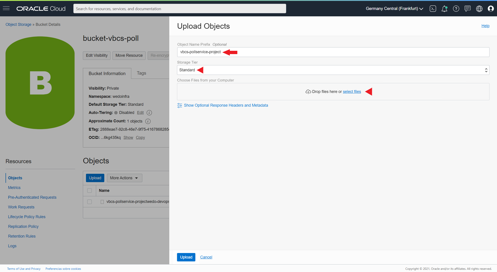

# Gigi's Polls - GitOps and LiquiBase HOL
This HOL is based in a Demo developed by Spain Presales Tech Team as part of an innovation initiative to approach Oracle Cloud Solutions by providing practical examples that could be “touched” and easily understood.

Demo is known as Gigi’s Pizza. This Use Case is focused in GitOps and LiquiBase. In Gigi's Pizza demo we have three microservices coded in different languages like nodejs and of course Java (Helidon framework). This three microservices are part of a delivery pizza app, one microservice controls the orders, other one controls the pizza delivery and the last one controls the accounting. 

In the first demo version, we don't have any feedback from the customer that receive a pizza, so imagine that the marketing and business areas want to know that feedback to improve the pizza delivery service or to create new pizza types. To create this new feedback service we have to modify the SQL DB PDB adding new tables in the squema and several fields in the tables. To create a DB squema version we will use LiquiBase, a software that let you create squema versions. We could return to a previous version of the Data Base after a failure or bad feeback of an app version (canary deployment for example) in an easy way with LiquiBase that is included with Oracle SQLPlus software.

This GitOps Hands On Lab includes:

* Oracle Visual Builder Studio.
* LiquidBase included in Oracle SQLPlus software.
* Oracle Cloud Infraestructure: 
  * Compute
  * Networking
  * Resource Manager (Terraform as a service)
  * DBCS
  * Serverless Functions
  * API Gateway

# In this Hands on Lab

All HOL was written in English and all the screenshots are in English Language. We recomend you that select English as your default language in Oracle Cloud. Select the Earth Icon at the top right (near your profile icon) and change the language to English.

In this HOL you will create a poll app for customer feedback.

You will:

* Create a new feedback webpage with Oracle Visual Builder Studio.
* Modify the current microservices to include the new Data.
* Deploy webapp in a separate server (IaaS compute) instead of use the internal Visual Builder server to improve cost savings.
* Terraform and sh scripts will be used to automate the deployment. 
* All deployment files (terraform + sh + liquibase scripts) will be in a GIT repo (GitOps) in Visula Builder Studio.
* Create the jobs and pipelines to deploy the app and modify the Data Base.
* Create the jobs and pipelines to delete the app and return the Data Base to initial state.

Let's create the new Service!

# Visual Builder Import
First Step to create the Gigi's Poll Service is to get the Visual Builder Studio project zip file from github and upload it to an Oracle Object Storage Bucket in your tenanty.

Download the zip file from github [here](https://github.com/oraclespainpresales/GigisPizzaHOL/raw/master/downloads/wedo-devops-pollservice-demo.zip)

Then upload it to an OSS Bucket in your tenancy. You can use a created OSS Bucket or create a new one. Next step will describe how to create a new OSS Bucket to upload the zip file.

## Creating the OSS Bucket
Go to Hamburguer Icon to open the Oracle Cloud Console menu. Select Storage and Buckets.

Click **Create Bucket** button to create a new Bucket in your compartment (note: review your compartment name before create the new buacket, to create the bucket in the appropiate compartment).

In the right window, change the name of the bucket to a descriptive one, for example [**bucket-vbcs-poll**]. Review the rest of the bucket features as default. Standard type and Encrypt using Oracle managed keys. Then click Create button to create the new Bucket.

The new bucket must be shown in the buckets list.

Click on it to access the bucket console menu and click **Upload** button to upload the zip file. 

In the right console menu you must write a descriptive name like [**vbcs-pollservice-project**], and drag and drop the zip file in the dotted square or click on "select files" link to open a file browser to select the zip file. 

After the upload, the file name and size will be shown just below the dotted quare. Next click **Upload** button to put the file in the OSS Bucket.

A new "Finish" menssage in the name/size will be shown and then you can click **Close** button to return to the bucket console menu.

The new zip file should be in the Object list of the Bucket.

Now you have the zip file prepared, to be imported in the Visual Builder Studio new project.

# Create the Visual Builder Project
Next step to create the new poll service will be create and import a new visual builder project that will contain all required files. This import will create a new GIT repo in your Visual Builder Studio. Let's start creating a new project from the Visual Builder Studio main panel -> Organization and click **Create** button.

Then write an appropiate and descriptive project name like [**Gigis poll Service**] and a little description. Keep the Security as Private and Preferred Language English. Then click **Next** button.

Next select Import Project from the project type list and click **Next** to continue with the creation process.

Now you must fill the form with your own credentials (you can get this credential from the OCI console, if you don't remember how to get this values you can read this [example](https://github.com/oraclespainpresales/GigisPizzaHOL/blob/master/microservices/hol5967_userguide.md#getting-key-config-data-from-oracle-cloud-tenancy)):

- Your Tenancy OCID.
- Your User OCID.
- Home Region.
- Your API Key Private key.
- Your API Key passphrase for the private key if you use one (optional).
- Your API Key Fingerprint.
- Your Compartment OCID, where the zip file was uploaded to the bucket.
- Your Storage namespace.

Then click **Next** button to continue.

If all values are correct then you can access your tenancy OSS and buckets. Select the bucket [**bucket-vbcs-poll**] created in the First part of the demo and the zip file [**vbcs-pollservice-projectwedo-devops-pollservice-demo.zip**] that you upload in there. Click **Finish** button to finish the project creation process. 

Then you should see the creation project process task list. Wait for a while (about 3 or 4 minutes) to VBCS finish all the tasks.

After project creation completion, you should see the new Project Gigi's Poll Service home page.

The Process continue importing the zip file to the new project, so you should wait about 20 o 25 minutes (depending of the overload of the vbcs service) to complete all the importing task. In this process you will get the GIT repos with all files (including the Serverless functions code in nodejs), the VBCS project (visual low code app), associated CI/CD pipelines and more.

# Review the Project files
After project creation and file zip import, you must have several GIT repos in your new project. 

There are four related to the Serverless Functions (developed in nodejs):
- gigispoll_fn_getNewUUID
- gigispoll_fn_verifyUUID
- gigispoll_fn_getOrderData
- gigispoll_fn_setOrderSurvey

And other 3 GIT repos related to Gitops, LiquiBase and VBCS app
- liquibase
- gigispoll_build
- gigispoll_vbcs

Select Git from the main menu to access to the GIT repos for review.

## liquibase git repo
In this repo you should have all files related to the liquibase functionality. The sqlScript folder contain the necessary script files to create and destroy tables and fields in the Data Base.

You must have 5 files, 4 sql files and a xml. 

### File controller_db_gigis.xml
Is the liquibase creation and destroy script controller. If you open it you could see that there are several changesets with the sql script to create/modify tables and fields in the Data Base, and the appropiate rollback sql script to rollback the creation/modification sql scripts. If you want to know more about liquibase please visit the [liquibase.org](https://www.liquibase.org/) web page they have more examples.

### SQL cript Files
They are the sql scripts, to create/modify the current schema. The new poll functionality need a change in the SQL PDB schema to add the new coments and survey score.
| File     |     Description |
|----------|:-------------:|
| script_uuidtable.sql |  create a new table in the SQL PDB Schema to store the user UUIDs. |
| script_uuidtable_rollback.sql |    rollback script of script_uuidtable.   |
| script_tablepayment_survey.sql | modify fields in tables to add the survey score and comments. |
| script_tablepayment_survey_rollback.sql | rollback script for script_tablepayment_survey. |

You can open the different files to review it if you want.

## gigispoll_vbcs repo
In this repo you should have the vbcs code of the survey web app. Is a vbcs project that ypu must use in the next steps in the HOL. 

## gigispoll_build repo
In this repo you should have al the GitOps part.
| File     |     Description |
|----------|:---------------:|
| build.sh | script file to create resources and install the webapp in OCI |
| destroy.sh | script file to destroy resources created by build.sh |
| gigispoll_rm.zip | zip file that contain the main.tf. It is used in the Resource Manager creation |
| main.tf | Terraform script that is applyed by Resource Manager to create the infraestructure in OCI |
| nopassphrase.key | private key to access to the created server and install several tools and vbcs webapp in the creation process.|

