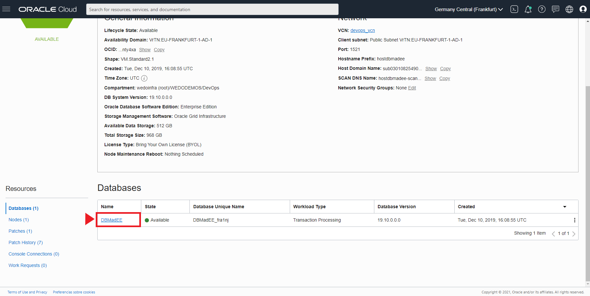
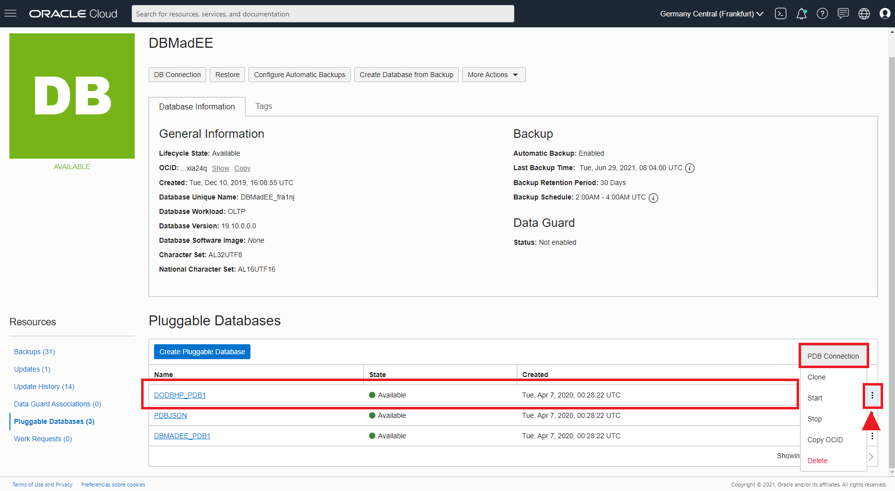

# Testing the Poll app
To test the poll webapp you could change something in the code that are into the GIT repos to trigger the creation pipeline, but for this HOL and academic purposes it's better to launch the creation pipeline by hand. This HOL should be made after the microservices HOL as suggested in the requirements for the HOL at the beggining of this document, so be sure that your microservices gigi's pizza app is up and running.

You could test the creation of the infrastructure and the Database changes even if the microservices app is not created, but you should have the Database up and the squemas created as a minimum.

## Before the pipeline creation launch.
Let's check the Database tables/fields and the OCI infrastructure before the pipeline creation launch. Starting with the database you will see the tables and fields that you might have created in the SQL PDB of gigis pizza. Then you will review the OCI infrastructure to see that nothing was created before the launcho of the pipeline that will create everything.

### Review the SQL PDB Tables.
You can use SQLcl or [SQL Developer](https://www.oracle.com/es/database/technologies/appdev/sqldeveloper-landing.html) to review that all tables are created in the SQL PDB. 

<details>
 <summary> Now you can access to the OCI administration console and review the PDBs, connections string and more. </summary>

First click in the OCI hamburger icon (top - left) 


Then click Oracle Database and next **Bare Metal, VM and Exadata**


Next select you Gigis Pizza Database from the Databases list.


Then, in your database menu, scroll down until you can see Resources left menu and Databases list. Your Database should be there.


Next, Click in your Datatabase name under Databases lists.



Then you can click in **Pluggable Databases** item in the *Resources* left menu.


Now you can select each PDB and get the connection string for example. To do that, click in the right tree vertical buttons of the PDB row and select **PDB Connection**.



You can copy the connection string clicking in the **copy** link.


</details>

In this HOL I will use *[SQL Developer](https://www.oracle.com/es/database/technologies/appdev/sqldeveloper-landing.html)* to show you what tables and fields are created before and after the pipeline trigger.

#### Before pipeline are triggered.
Open your **SQLDeveloper app** and configure the SQL PDB connection with your credentials and the connection string that you could get in the OCI console (as shown before). For example if your connection string is something like 
```
<servername>.<sub-number>.<yourvcn>.oraclevcn.com:1521/<PDBNAME>.<sub-number>.<yourvnc>.oraclevcn.com
```
You must use in SQLDeveloper:
- *<servername>.<sub-number>.<yourvcn>.oraclevcn.com* as **Host Name** 
- *<PDBNAME>.<sub-number>.<yourvnc>.oraclevcn.com* as **Service Name** 

Then click in *Test* button to test the connection to the SQL PDB, and check the **Status** message (it should be *Correct*), if the status is **failed** then check your connection variables and try again. After connection status is **Correct**, click in **Connect** button to connect to the SQL PDB.


 
Then review that you have the **PAYMENTS** table and next 7 fields:
 - PAYMENTCODE
 - ORDERID
 - PAYMENTTIME
 - PAYMENTMETHOD
 - ORIGINALPRICE
 - TOTALPAID
 - CUSTOMERID
 
 
