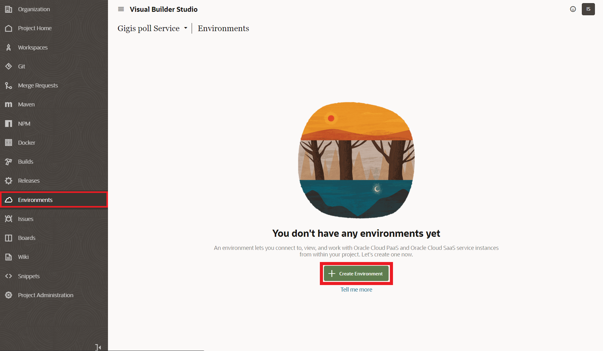
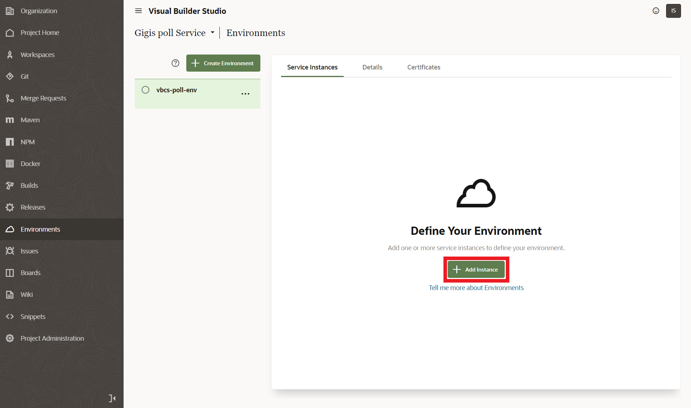
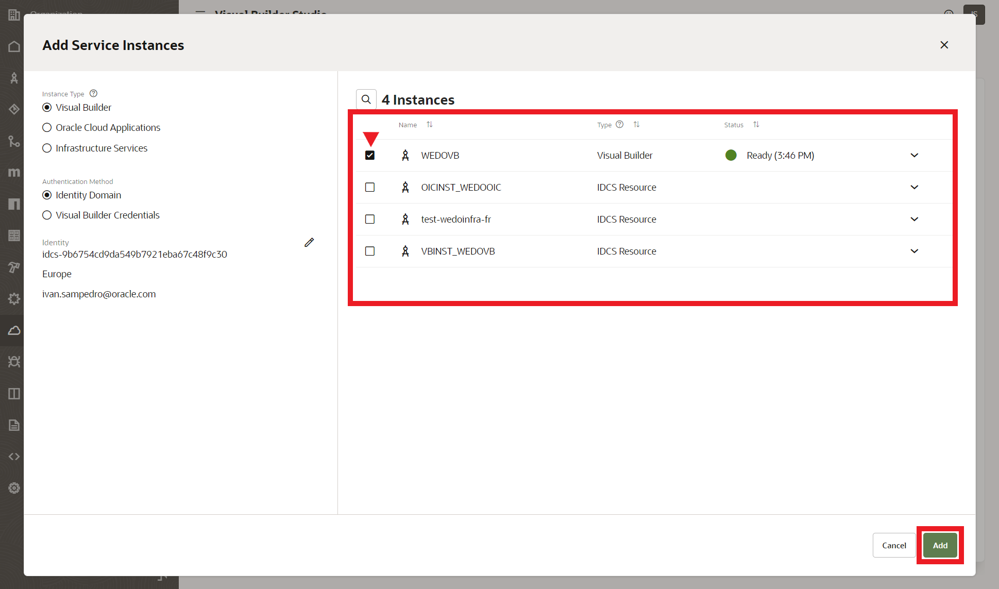
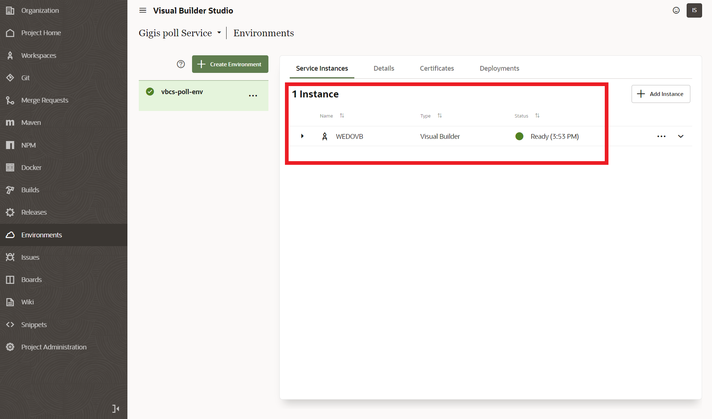
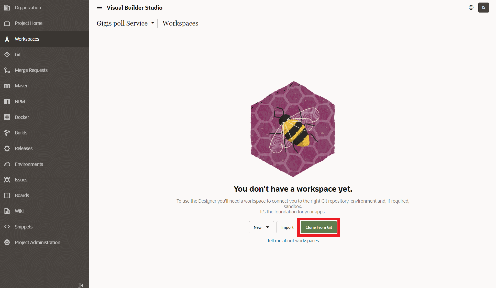
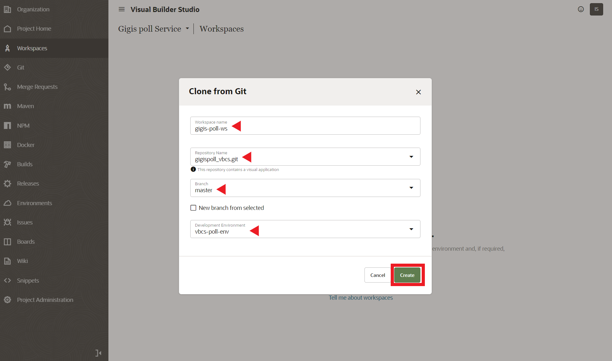
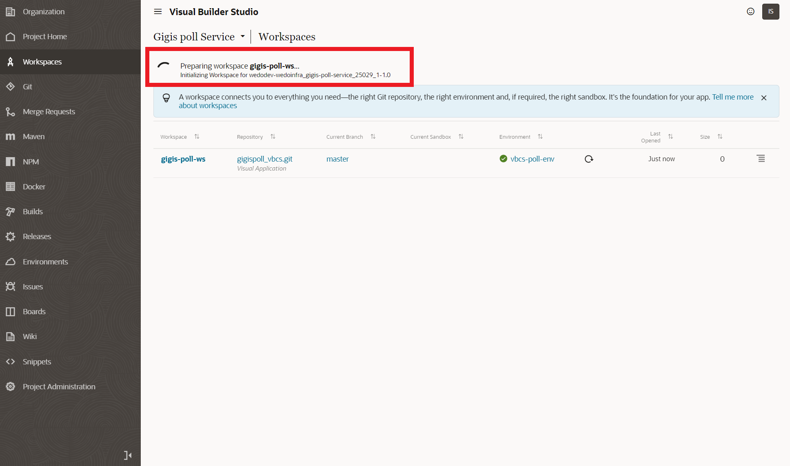
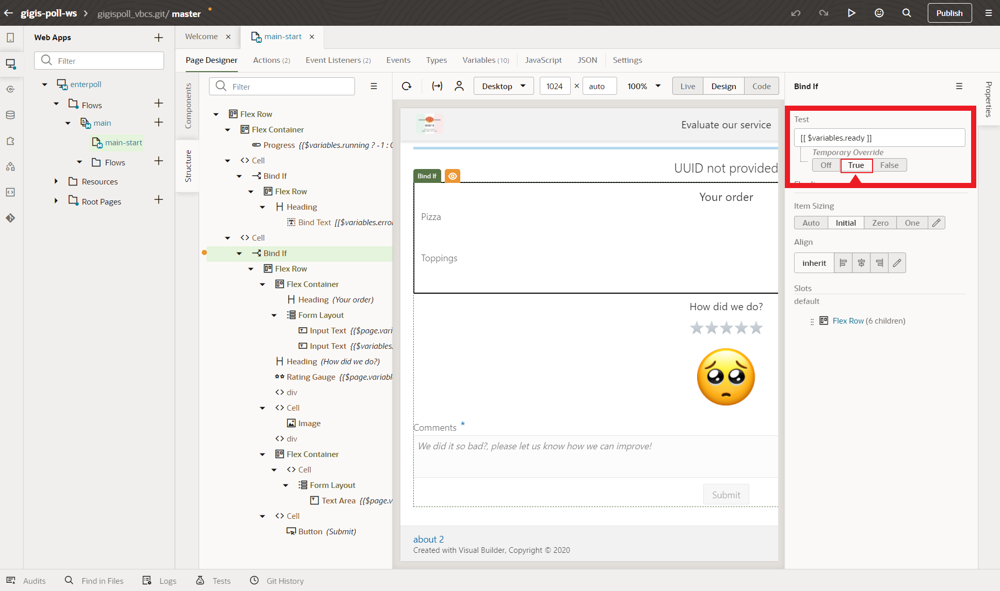

# (OPTIONAL) Creating VBCS Environment & Workspace - poll webapp
In this section you will create a new vbcs environment to deploy and run the vbcs poll webapp (VBCS runtime). After environment creation you will create a new workspace to enable the low code designer. A workspace connect you to the right Git repository, environment and, if required, sandbox. It’s the foundation for your apps.

## Creating VBCS Environment

Clink on **Envionments** in the vbcs main menu. Then Click in **Create Environment** button.

Enter an environment descriptive name and optionally a description. Then Click **Create** Button to start the creation process.

Now you must add a new VBCS server instance in whitch vbcs workspace will be executed. Click **Add Instance**.

You should see a list of vbcs instances that you are running in OCI. There are two options here, vbcs instances from OIC (Oracle Integration Cloud Service) or vbcs standalone instances. If you don't have any instances in your list, please you must create one. You can follow next [manual](https://docs.oracle.com/en/cloud/paas/visual-builder/visualbuilder-administration/set-oracle-visual-builder-studio.html#GUID-8EE9FC19-70A0-4508-A6B1-FB8425C13A91) to setup Visual Builder Studio and create a new VBCS instance.

Select one instance, in our HOL you must create and select a standalone vbcs instance. Then click **Add* button.

Now you have an environment with a vbcs instance ready to use.

## Creating VBCS Workspaces

Now you can clik in **Workspaces** in the vbcs main menu. There are three options:

- New .- if you were creating a new vbcs workspace from scratch
- Import .- if you were importing a zip webapp project file (not the entire vbcs project, only the webapp).
- Clone From Git .- this the option yoy must use as you import an entire vbcs project including the webapp that is in a vbcs git repo right now.

Click **Clone From Git**

Then write a name for the vbcs webapp workspace. 
Then select the webapp git repo **[gigispoll_vbcs.git]**. 
Branch as master.
Development Environment you should select the recently created environment **[vbcs-poll-env]**

You should see a preparing message and after a couple of minutes you will have the new workspace ready to use.

Enter in the workspace Enterpoll > Flows > main > main-start that is the principal webapp page.

For review purposes, if you want to check the entire webpage, you must select Structure tab, then **Bind if** below the second Cell object (in the tree) and then in Temporary Override, check **True**. This process will put a temporary true value in the variables.ready variable allowing you to see all the web content. Now you could modify or design if you want your own poll web form.

Our HOL is out of creating or modifying the vbcs webapp, so lets return to the main vbcs menu clicking in the back arrow at the top of the workspace window.

